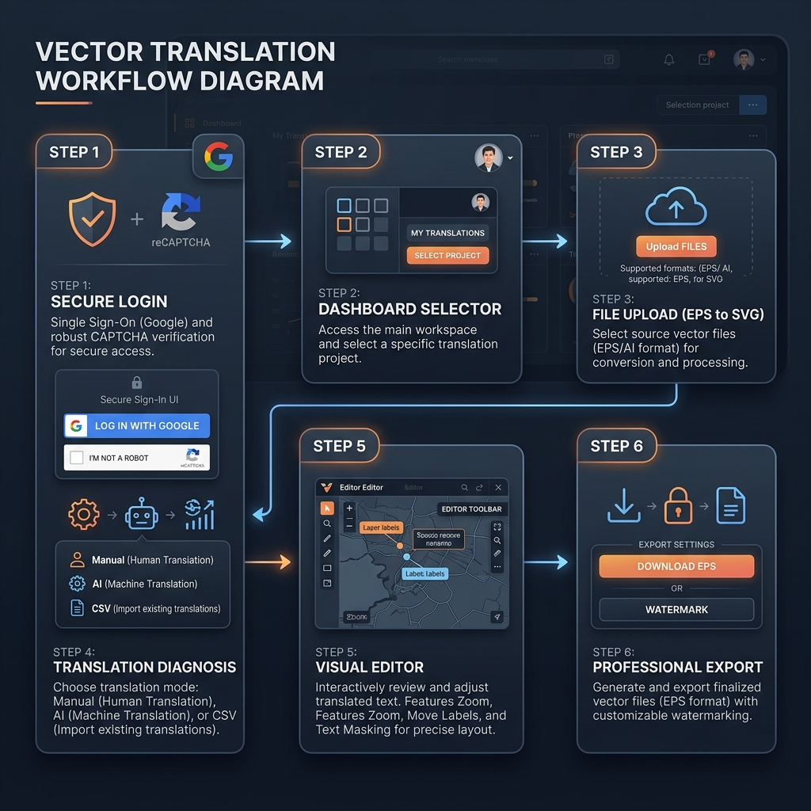

# Aura Translation Tool: Detailed Process Workflow

This document provides a comprehensive, step-by-step overview of the architecture and user flow for the **Aura Translation Suite**. It includes all technical mechanics described in business-friendly terms.

---

## Detailed System Flowchart

---

## Technical Stages & Business Mechanics

### Step 1: Secure Login & Verification
*   **Google Sign-In**: Users authenticate securely using Google OAuth, which ensures that only authorized corporate accounts can access the tool.
*   **CAPTCHA Protection**: A simulated "I'm not a robot" client-side verification check that acts as a guard against accidental login clicks (configured as a zero-dependency mock without active Google Server validation).
*   **Session Save**: The active login state is saved in the browser's local storage. If the page is refreshed, the user remains signed in and skips the login portal.
*   **Silent Activity Audit**: Upon login, user data (name, email, and timestamp) is silently recorded in a secure **Google Sheet** (stored on your Google Drive) for activity audit logs.

### Step 2: Dashboard Selector
*   **Navigation Hub**: The dashboard directs users to their desired workspace:
    *   **LingoGenie**: Launches the core translation website in a new tab.
    *   **Aura EPS**: Hides the dashboard and initializes the EPS Translation panel.

### Step 3: EPS File Upload & Client-Side Conversion
*   **Localhost Bypass**: For local testing and development, the uploader automatically bypasses the daily conversion limit check. On production, it enforces a daily budget to protect API costs.
*   **Background Format Conversion**: Since browsers cannot parse binary `.eps` vectors directly, the file is securely uploaded to **CloudConvert** via a client-side API job, converted to a scalable vector graphic (`.svg`), and rendered on the browser screen.

### Step 4: Diagnosis Stage
The system scans the uploaded graphic structure and counts unique text elements. Users are presented with three distinct translation options:
*   **Manual Edit**: A live translation table where text can be edited manually.
*   **AI Prompt Helper**: Generates an pre-formatted text list and prompts to copy-paste into ChatGPT or Claude for automated translation.
*   **CSV Excel Import/Export**: Users can export translations as a spreadsheet (`.csv`), translate it offline in Excel, and upload it back.

### Step 5: Live Visual Editor
Once translations are loaded, the user enters a WYSIWYG visual editor:
*   **Interactive Vector Canvas**: A pan-and-zoom workspace where the user can drag text labels to avoid overlapping lines or shapes.
*   **Text Adjustment Tools**: Modify font sizes, reset labels, or use **Bulk Shrink** to automatically scale down long translations.
*   **Safety Undo/Redo**: A visual undo/redo stack tracks layout adjustments, allowing the user to reverse actions.
*   **Text Masking**: Apply clean, high-contrast background highlights behind translated labels to make text readable over complex graphical diagrams.

### Step 6: Export & Auto-Watermarking
*   **Watermark Injection**: A proportional, clean branding watermark (`www.lingochaps.com`) is injected into the bottom-right corner of the vector graphics, scaling dynamically to the diagram's dimensions.
*   **EPS Reconstruction**: The tool compiles the final XML structure and returns it to CloudConvert.
*   **Final Delivery**: CloudConvert converts the vector representation back to the original binary `.eps` format, downloading a print-ready, high-quality vector file.
